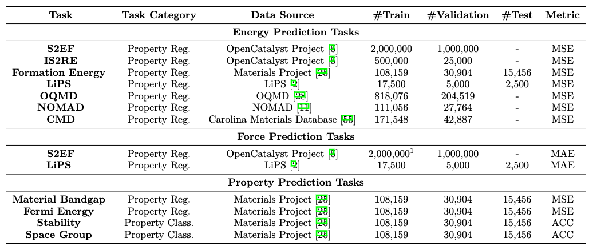

<h1 align="center">Open MatSci ML Toolkit : A Broad, Multi-Task Benchmark for Solid-State Materials Modeling</h1>

<div align="center">

[](https://openreview.net/forum?id=QBMyDZsPMd)
[](https://openreview.net/forum?id=_7bEq9JQKIJ)
[](https://lightning.ai/docs/pytorch/1.8.6)
[](https://pytorch.org/get-started/locally/)
[](https://docs.dgl.ai/en/latest/)
[](https://pytorch-geometric.readthedocs.io/en/2.3.1/)
[](https://opensource.org/licenses/MIT)

</div>

This is the implementation of the MatSci ML benchmark, which includes ~1.5 million ground-state materials collected from various datasets, as well as integration of the OpenCatalyst dataset supporting diverse data format (point cloud, DGL graphs, PyG graphs), learning methods (single task, multi-task, multi-data) and deep learning models. Primary project contributors include: Santiago Miret (Intel Labs), Kin Long Kelvin Lee (Intel AXG), Carmelo Gonzales (Intel Labs), Mikhail Galkin (Intel Labs), Marcel Nassar (Intel Labs), Matthew Spellings (Vector Institute).

### News

- [2023/09/27] Release of [pre-packaged lmdb-based datasets](https://zenodo.org/record/8381476) from v1.0.0 via Zenodo.
- [2023/08/31] Initial release of the MatSci ML Benchmark with integration of ~1.5 million ground state materials.
- [2023/07/31] The Open MatSci ML Toolkit : A Flexible Framework for Deep Learning on the OpenCatalyst Dataset paper is accepted into TMLR. See previous version for code related to the benchmark.

### Introduction

The MatSci ML Benchmark contains diverse sets of tasks (energy prediction, force prediction, property prediction) across a broad range of datasets (OpenCatalyst Project [1], Materials Project [2], LiPS [3], OQMD [4], NOMAD [5], Carolina Materials Database [6]). Most of the data is related to energy prediction task, which is the most common property tracked for most materials systems in the literature. The codebase support single-task learning, as well as multi-task (training one model for multiple tasks within a dataset) and multi-date (training a model across multiple datsets with a common property). Additionally, we provide a generative materials pipeline that applies diffusion models (CDVAE [7]) to generate new unit cells.


<p align="center">
  
</p>

The package follows the original design principles of the Open MatSci ML Toolkit, including:
- Ease of use for new ML researchers and practitioners that want get started on interacting with the OpenCatalyst dataset.
- Scalable computation of experiments leveraging [PyTorch Lightning](https://www.pytorchlightning.ai/) across different computation capabilities (laptop, server, cluster) and hardware platforms (CPU, GPU, XPU) without sacrificing performance in the compute and modeling.
- Integrating support for [DGL](https://docs.dgl.ai/en/0.9.x/) and [PyTorch Geometric](https://pytorch-geometric.readthedocs.io/en/latest/) for rapid GNN development.

The examples outlined in the next section how to get started with Open MatSci ML Toolkit using simple Python scripts, Jupyter notebooks, or the PyTorch Lightning CLI for a simple training on a portable subset of the original dataset (dev-set) that can be run on a laptop. Subsequently, we scale our example python script to large compute systems, including distributed data parallel training (multiple GPU on a single node) and multi-node training (multiple GPUs across multiple nodes) in a computing cluster. Leveraging both PyTorch Lightning and DGL capabilities, we can enable the compute and experiment scaling with minimal additional complexity.

### Installation

- `Docker`: We provide a Dockerfile inside the `docker` that can be run to install a container using standard docker commands.
- `Conda`: We have included a `conda` specification that provides a complete installation including XPU support for PyTorch. Run `conda env create -n matsciml --file conda.yml`, and in the newly created environment, run `pip install './[all]'` to install all of the dependencies.

Additionally, for a development install, one can specify the extra packages like `black` and `pytest` with `pip install './[dev]'`. These can be
added to the commit workflow by running `pre-commit install` to generate `git` hooks.

## Examples

The `examples` folder contains simple, unit scripts that demonstrate how to use the pipeline in specific ways:

<details>
<summary>
Get started with different datasets with "devsets"
</summary>

```bash
# Materials project
python examples/datasets/materials_project/single_task_devset.py

# Carolina materials database
python examples/datasets/carolina_db/single_task_devset.py

# NOMAD
python examples/datasets/nomad/single_task_devset.py

# OQMD
python examples/datasets/oqmd/single_task_devset.py
```
</details>

<details>
<summary>
Representation learning with symmetry pretraining
</summary>

```bash
# uses the devset for synthetic point group point clouds
python examples/tasks/symmetry/single_symmetry_example.py
```
</details>

<details>
<summary>
Example notebook-based development and testing
</summary>

```bash
jupyter notebook examples/devel-example.ipynb
```
</details>

For more advanced use cases:

<details>
<summary>
Checkout materials generation with CDVAE
</summary>

CDVAE [7] is a latent diffusion model that trains a VAE on the reconstruction
objective, adds Gaussian noise to the latent variable, and learns to predict
the noise. The noised and generated features inlcude lattice parameters,
atoms composition, and atom coordinates.
The generation process is based on the annealed Langevin dynamics.

CDVAE is implemented in the `GenerationTask` and we provide a custom data
split from the Materials Project bounded by 25 atoms per structure.
The process is split into 3 parts with 3 respective scripts found in
`examples/model_demos/cdvae/`.
1. Training CDVAE on the reconstruction and denoising objectives: `cdvae.py`
2. Sampling the structures (from scratch or reconstruct the test set): `cdvae_inference.py`
3. Evaluating the sampled structures: `cdvae_metrics.py`

The sampling procedure takes some time (about 5-8 hours for 10000 structures
depending on the hardware) due to the Langevin dynamics.
The default hyperparameters of CDVAE components correspond to that from the
original paper and can be found in `cdvae_configs.py`.


```bash
# training
python examples/model_demos/cdvae/cdvae.py --data_path <path/to/splits>

# sampling 10,000 structures from scratch
python examples/model_demos/cdvae/cdvae_inference.py --model_path <path/to/checkpoint> --data_path <path/to/splits> --tasks gen

# evaluating the sampled structures
python examples/model_demos/cdvae/cdvae_metrics.py --root_path <path/to/generated_samples> --data_path <path/to/splits> --tasks gen
```
</details>

<details>
<summary>
Multiple tasks trained using the same dataset
</summary>

```bash
# this script requires modification as you'll need to download the materials
# project dataset, and point L24 to the folder where it was saved
python examples/tasks/multitask/single_data_multitask_example.py
```

Utilizes Materials Project data to train property regression and material classification jointly
</details>

<details>
<summary>
Multiple tasks trained using multiple datasets
</summary>

```bash
python examples/tasks/multitask/three_datasets.py
```

Train regression tasks against IS2RE, S2EF, and LiPS datasets jointly
</details>


### Data Pipeline

In the `scripts` folder you will find two scripts needed to download and preprocess datasets: the `download_datasets.py` can be used to obtain Carolina DB, Materials Project, NOMAD, and OQMD datasets, while the `download_ocp_data.py` preserves the original Open Catalyst script.

In the current release, we have implemented interfaces to a number of large scale materials science datasets. Under the hood, the data structures pulled from each dataset have been homogenized, and the only real interaction layer for users is through the `MatSciMLDataModule`, a subclass of `LightningDataModule`.

```python
from matsciml.lightning.data_utils import MatSciMLDataModule

# no configuration needed, although one can specify the batch size and number of workers
devset_module = MatSciMLDataModule.from_devset(dataset="MaterialsProjectDataset")
```

This will let you springboard into development without needing to worry about _how_ to wrangle with the datasets; just grab a batch and go! With the exception of Open Catalyst, datasets will typically return point cloud representations; we provide a flexible transform interface to interconvert between representations and frameworks:

<details>
<summary>
From point clouds to DGL graphs
</summary>

```python
from matsciml.datasets.transforms import PointCloudToGraphTransform

# make the materials project dataset emit DGL graphs, based on a atom-atom distance cutoff of 10
devset = MatSciMLDataModule.from_devset(
    dataset="MaterialsProjectDataset",
    dset_kwargs={"transforms": [PointCloudToGraphTransform(backend="dgl", cutoff_dist=10.)]}
)
```
</details>

<details>
<summary>
But I want to use PyG?
</summary>

```python
from matsciml.datasets.transforms import PointCloudToGraphTransform

# change the backend argument to obtain PyG graphs
devset = MatSciMLDataModule.from_devset(
    dataset="MaterialsProjectDataset",
    dset_kwargs={"transforms": [PointCloudToGraphTransform(backend="pyg", cutoff_dist=10.)]}
)
```

</details>

<details>
<summary>
What else can I configure with `MatSciMLDataModule`?
</summary>

Datasets beyond devsets can be configured through class arguments:

```python
devset = MatSciMLDataModule(
    dataset="MaterialsProjectDataset",
    train_path="/path/to/training/lmdb/folder",
    batch_size=64,
    num_workers=4,     # configure data loader instances
    dset_kwargs={"transforms": [PointCloudToGraphTransform(backend="pyg", cutoff_dist=10.)]},
    val_split="/path/to/val/lmdb/folder"
)
```

In particular, `val_split` and `test_split` can point to their LMDB folders, _or_ just a float between [0,1] to do quick, uniform splits. The rest, including distributed sampling, will be taken care of for you under the hood.
</details>

<details>

<summary>
How do I compose multiple datasets?
</summary>

Given the amount of configuration involved, composing multiple datasets takes a little more work but we have tried to make it as seamless as possible. The main difference from the single dataset case is replacing `MatSciMLDataModule` with `MultiDataModule` from `matsciml.lightning.data_utils`, configuring each dataset manually, and passing them collectively into the data module:

```python
from matsciml.datasets import MaterialsProjectDataset, OQMDDataset, MultiDataset
from matsciml.lightning.data_utils import MultiDataModule

# configure training only here, but same logic extends to validation/test splits
train_dset = MultiDataset(
  [
    MaterialsProjectDataset("/path/to/train/materialsproject"),
    OQMDDataset("/path/to/train/oqmd")
  ]
)

# this configures the actual data module passed into Lightning
datamodule = MultiDataModule(
  batch_size=32,
  num_workers=4,
  train_dataset=train_dset
)
```

While it does require a bit of extra work, this was to ensure flexibility in how you can compose datasets. We welcome feedback on the user experience! 😃

</details>

### Task abstraction

In Open MatSci ML Toolkit, tasks effective form learning objectives: at a high level, a task takes an encoding model/backbone that ingests a structure to predict one or several properties, or classify a material. In the single task case, there may be multiple _targets_ and the neural network architecture may be fluid, but there is only _one_ optimizer. Under this definition, multi-task learning comprises multiple tasks and optimizers operating jointly through _a single embedding_.


## References
- [1] Chanussot, L., Das, A., Goyal, S., Lavril, T., Shuaibi, M., Riviere, M., Tran, K., Heras-Domingo, J., Ho, C., Hu, W. and Palizhati, A., 2021. Open catalyst 2020 (OC20) dataset and community challenges. Acs Catalysis, 11(10), pp.6059-6072.
- [2] Jain, A., Ong, S.P., Hautier, G., Chen, W., Richards, W.D., Dacek, S., Cholia, S., Gunter, D., Skinner, D., Ceder, G. and Persson, K.A., 2013. Commentary: The Materials Project: A materials genome approach to accelerating materials innovation. APL materials, 1(1).
- [3] Batzner, S., Musaelian, A., Sun, L., Geiger, M., Mailoa, J.P., Kornbluth, M., Molinari, N., Smidt, T.E. and Kozinsky, B., 2022. E (3)-equivariant graph neural networks for data-efficient and accurate interatomic potentials. Nature communications, 13(1), p.2453.
- [4] Kirklin, S., Saal, J.E., Meredig, B., Thompson, A., Doak, J.W., Aykol, M., Rühl, S. and Wolverton, C., 2015. The Open Quantum Materials Database (OQMD): assessing the accuracy of DFT formation energies. npj Computational Materials, 1(1), pp.1-15.
- [5] Draxl, C. and Scheffler, M., 2019. The NOMAD laboratory: from data sharing to artificial intelligence. Journal of Physics: Materials, 2(3), p.036001.
- [6] Zhao, Y., Al‐Fahdi, M., Hu, M., Siriwardane, E.M., Song, Y., Nasiri, A. and Hu, J., 2021. High‐throughput discovery of novel cubic crystal materials using deep generative neural networks. Advanced Science, 8(20), p.2100566.
- [7] Xie, T., Fu, X., Ganea, O.E., Barzilay, R. and Jaakkola, T.S., 2021, October. Crystal Diffusion Variational Autoencoder for Periodic Material Generation. In International Conference on Learning Representations.


## Citations

If you use Open MatSci ML Toolkit in your technical work or publication, we would appreciate it if you cite the Open MatSci ML Toolkit paper in TMLR:

<details>

<summary>
Miret, S.; Lee, K. L. K.; Gonzales, C.; Nassar, M.; Spellings, M. The Open MatSci ML Toolkit: A Flexible Framework for Machine Learning in Materials Science. Transactions on Machine Learning Research, 2023.
</summary>

```bibtex
@article{openmatscimltoolkit,
  title = {The Open {{MatSci ML}} Toolkit: {{A}} Flexible Framework for Machine Learning in Materials Science},
  author = {Miret, Santiago and Lee, Kin Long Kelvin and Gonzales, Carmelo and Nassar, Marcel and Spellings, Matthew},
  year = {2023},
  journal = {Transactions on Machine Learning Research},
  issn = {2835-8856}
}
```

</details>

If you use v1.0.0, please cite our paper:

<details>

<summary>
Lee, K. L. K., Gonzales, C., Nassar, M., Spellings, M., Galkin, M., & Miret, S. (2023). MatSciML: A Broad, Multi-Task Benchmark for Solid-State Materials Modeling. arXiv preprint arXiv:2309.05934.
</summary>

```bibtex
@article{lee2023matsciml,
  title={MatSciML: A Broad, Multi-Task Benchmark for Solid-State Materials Modeling},
  author={Lee, Kin Long Kelvin and Gonzales, Carmelo and Nassar, Marcel and Spellings, Matthew and Galkin, Mikhail and Miret, Santiago},
  journal={arXiv preprint arXiv:2309.05934},
  year={2023}
}
```

</details>


Please cite datasets used in your work as well. You can find additional descriptions and details regarding each dataset [here](matsciml/datasets/DATASETS.md).
