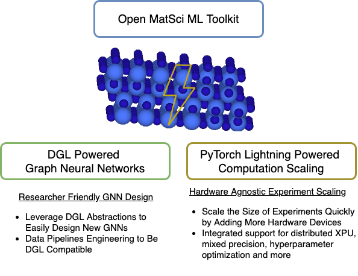

<h1 align="center">Open MatSci ML Toolkit : A Flexible Framework for Deep Learning on the OpenCatalyst Dataset</h1>
<!-- # Open MatSci ML Toolkit : A Flexible Framework for Deep Learning on the OpenCatalyst Dataset 
## Introduction -->

Catalysts are essential components in chemical systems that aim to accelerate speed of chemical reactions. Catalytic materials design, especially low-cost catalysts, remain an ongoing challenge that will continue to be more important for a variety of applications, including renewable energy and sustainable agriculture. The [OpenCatalyst Project](https://opencatalystproject.org/), jointly developed by Fundamental AI Research (FAIR) at Meta AI and Carnegie Mellon University's (CMU) Department of Chemical Engineering, encompasses one of the first large-scale datasets to enable the application of machine learning (ML) techniques containing over 1.3 million molecular relaxations of 82 adsorbates on 55 different catalytic surfaces. The original release from 2019 has also been supplemented by subsequent updates in [2020 and 2022](https://github.com/Open-Catalyst-Project/ocp/blob/main/DATASET.md) and maintains an active leaderboard and annual competition. The significant effort of providing high-quality data for catalytic materials is a major step forward in enabling ML researchers and practitioner to innovate on materials design challenges. The original combines a large variety of deep learning and high performance computing features that have been shown to train performant for the different tasks outlined in the dataset releases, as well as enabling the development of new geometric deep learning architectures ([DimeNet](https://arxiv.org/pdf/2003.03123), [GemNet](https://proceedings.neurips.cc/paper/2021/file/35cf8659cfcb13224cbd47863a34fc58-Paper.pdf) at greater scales approaching GNNs with a [billion parameters](https://arxiv.org/pdf/2203.09697).


<p align="center">
  
</p>


 While the toolkit of the original OpenCatalyst repository is very powerful, it contains a significant amount of complexity due to various interacting pieces of software. This can make it very challenging for new ML researchers to interact with the repository, create new architectures or modeling methods and run experiments on the dataset. To address the challenges of usability and ease of use, we introduce Open MatSci ML Toolkit, a flexible and easy-to-scale framework for deep learning on the Open Catalyst Dataset. We designed Open MatSci ML Toolkit with the following basic principles and features:
- Ease of use for new ML researchers and practitioners that want get started on interacting with the OpenCatalyst dataset.
- Scalable computation of experiments leveraging [PyTorch Lightning](https://www.pytorchlightning.ai/) across different computation capabilities (laptop, server, cluster) and hardware platforms (CPU, GPU, XPU) without sacrificing performance in the compute and modeling.
- Integrating support for [DGL](dgl.ai) for rapid GNN development to complement the original's repo usage of [PyTorch Geometric](https://pytorch-geometric.readthedocs.io/en/latest/).

The examples outlined in the next section how to get started with Open MatSci ML Toolkit using a simple python script, jupyter notebook or the PyTorchLightning CLI for a simple training on a subset of the original dataset (dev-set) that can be run on a laptop. Subsequently, we scale our example python script to large compute systems, including Distributed Training (Multiple GPU on a Single Node) and Multi-Node Training (Multiple GPUS across Multiple Nodes) in a computing cluster. Leveraging both PyTorch Lightning and DGL capabilities, we can enable the compute and experiment scaling with minimal additional complexity.

### Installation

- `pip`: We recommend installing inside a virtual environment with `python -m venv matsciml_env && pip install -r docker/requirements` from the main directory
- `conda`: We recommend installing inside a virtual with `conda env create --name matsciml_env --file=pl-env.yml` from the main directory
- `Docker`: We provide a Dockerfiles inside the `docker` that can be run to install a container with pip (`Dockerfile.pip`) or conda (`Dockerfile.conda`)

Additionally, for a development install, one can specify the extra packages like `black` and `pytest` with `pip install './[dev]'`.

## Examples

The `examples` folder contains simple, unit scripts that demonstrate how to use the pipeline in specific ways:

- [Basic script for task training with PyTorch Lightning abstractions](examples/simple_example_pt_lightning.py)
- [Manual training; the traditional way](examples/simple_example_torch.py)
- [Distributed data parallelism with CPUs on a SLURM managed cluster](examples/simple_example_slurm.py)
- [Using the Lightning CLI with YAML configuration files](examples/simple_cli_example.sh)
- [Model development and testing in a Jupyter notebook](examples/devel-example.ipynb)
- [Multi-GPU training script](examples/simple_example_multi_node.py)
- [Modifying the pipeline with `Callbacks`](examples/train_with_callbacks_example.py)

## PyTorch Lightning Refactor

The Open MatSci ML Toolkit software framework was built with the aim of transparency in the implementation to enable agility for machine learning researchers to apply novel model architectures and training techniques to scientific data, particularly the OpenCatalyst dataset. Given those aspirations, we performed some refactoring of the code in the original repository and added additional functionality.


### Data Pipeline

Our data pipeline leverages the processing capabilities of the original OpenCatalyst repo with additional modifications to provide flexibility to process the data in various format, including:

- Support for generalized, abstract data structures that can be saved in `lmdb` format and a sub-sampling script for small datasets in small compute testing environments
- Use of `pl.LightningDataModule` abstracts away splits, distributed loading, and data management while running experiments
- DGL data objects are defined in `ocpmodel/datasets` and the classes for DGL data pre-processing is contained in `ocpmodel/preprocessing`

#### S2EF

For streamlined processing of the S2EF 200k subset, you can use the following set of commands similar to [orginal repo's pipeline](https://github.com/Open-Catalyst-Project/ocp/blob/main/DATASET.md#download-and-preprocess-the-dataset):
- Ensure all requirements are installed in the virtual environment per the installtion instructions above
- run `python scripts/download_data.py --task s2ef --split 200k --num-workers 1 --get-edges --ref-energy --data-path <path-to-data>`

The `--data-path` specifies the output location of the processed dataset,  `--task` specifies the task for which the data is to be downloaded with `--split` specifying the data split in the case of S2EF; `--ref-energy` subtracts the reference energy from raw energies and `--get-edges` creates the edges for the graph structure.

#### IS2RE

For IS2RE, we provide pre-processed DGL graphs for all the data splits (10K, 100K, all) at: https://zenodo.org/record/7411133#.Y5DzRezMKX0.

The minimal energy path to testing and development would be to use the minimal devset. There is a convenient mechanism for getting the DGL version of the devset regardless
of how you install the package:

```python
from ocpmodels.lightning.data_utils import DGLDataModule

# no configuration needed, although one can specify the batch size and number of workers
devset_module = DGLDataModule.from_devset()
```

This will let you springboard into development without needing to worry about _how_ to wrangle with the datasets; just grab a batch and go! This
mechanism is also used for the unit tests pertaining to the data pipeline.

### Task abstraction

- Abstract original OCP training tasks as `pl.LightningModule`s: base class manages the model abstraction, and children (e.g. `S2EFLightningModule`) takes care of training/validation loop
  - This pattern ensures extendibility: task and data flexibility for future tasks, or different model architectures (e.g. those that do not use graphs representations)
- Logging to any PL supported platform; default is Tensorboard, but can send data to W&B, SigOpt (thanks to Carmelo and Krzysztof)
- HPO with any PL supported platform, not just Ray

### Experiment tracking

By implementing the pipeline with PyTorch Lightning, we can take advantage of the extensive logging/experiment tracking ecosystem available to many MLOps platforms. The two main
abstractions relevant to this are PyTorch Lightning [`Callback`s](https://pytorch-lightning.readthedocs.io/en/1.6.3/extensions/callbacks.html) and [`Logger`s](https://pytorch-lightning.readthedocs.io/en/1.6.3/extensions/logging.html).
With the former, you can configure things like automatic model checkpointing every $k$ steps, use it to profile your code (see the `ocpmodels.lightning.profiling` module for examples), early stopping mechanisms, and more. With the
latter, you can log arbitrary data into a variety of different formats: CSV for simple debugging, Tensorboard for increased interactivity, and platforms such as SigOpt (implemented in Open MatSci ML Toolkit), Weights & Biases, and Neptune.


## Deep Graph Library (DGL) Refactor

The original OpenCatalyst repo leverages [Pytorch Geometric (PyG)](https://pytorch-geometric.readthedocs.io/en/latest/) for implementing various neural networks for molecular embeddings. For Open MatSci ML Toolkit, we chose to build on top of the Deep Graph Library (DGL) instead. While both PyG and DGL are highly performant libraries for graph neural networks and the decision to choose one over the other is subjective, we motivate our choice of DGL for this library as follows:

- _**Graph abstraction:**_ the dgl graph data structure `dgl.DGLGraph` offers more flexibility for storing diverse molecular data over the PyG structure `torch_geometric.data.Data`. This abstraction allows for more general data pipelines amicable to experimentation and ablation studies; two qualities that are important in scientific exploration. 
- _**Cross-platform optimization:**_ both DGL and PyG are well optimized for single-node GPU deployment; however, DGL also supports additional platforms, such as Intel's x86,  that help accelerate GNNs on a wide range of hardware platforms.
- _**Support for sampling-based, and distributed training beyond data-parallel:**_ many applications involve large graph data that doesn't fit onto a single GPU. Such cases require specialized sampling techniques to either shrink the graph size or distribute the storage across multiple nodes. While both PyG and DGL support sampling-based training, DGL is more mature when it comes to sampling graphs and running distributed training of GNNs [ref].

We discuss each of the above points in more details:

### Graph Abstraction:
PyG's `Data` has a graph data structure composed of the following fixed attributes: node feature matrix `x`, edges `edge_index`, edge attributes `edge_attr`, labels `y`, and node position matrix `pos`. Additional attributes can be set using keyword argument collection in the constructor. 
In contrast, DGL's `DGLGraph` provides a dictionary-style access to graph data through `DGLGraph.ndata` (node features) and `DGLGraph.edata` (edge features). These dictionaries don't impose any restrictions on feature names or number; however, the `DGLGraph` object will enforce that the feature dimension match the number of nodes and edges.
 
While PyG's `Data` covers a large part of the use cases in the GNN world, we argue that due to the diversity of molecular data, using the flexible `DGLGraph` as example representation decouples the dataset from the model-specific data pipeline while retaining data consistency such as matching the number of features and edges. This lends itself to a wide variety of customized pipelines that can explore various model explorations and ablation studies. Consider molecular data that contains various features on both atoms and bonds. For example, QM9 atom features includes, among others, atom coordinates `x`, atom type `tp`, atomic number `z`, number of hydrogens `nH`, hybridization [2]. A given example might contain the following fields:
```python
class Example(NamedTuple):
  x: List[float]
  tp: List[bool]
  z: int
  nH: int
  bonds: List[Tuple[int, int]]
```
Assuming all the above fields have been cast into their appropriate `Tensor` types, converting `Example` to PyG's `Data` can be done as follows 
```python
example_dict = example._asdict()
src, dst = zip(*example_dict.pop('bonds'))
edge_index = torch.hstack((src, dst))
pos = example_dict.pop('x')

# assign to fixed attributes
embed_tp, embed_z, embed_nH = embed(example)
feat = torch.cat((embed_tp, embed_z, embed_nH)
data = Data(pos=pos, x=feat, edge_index=edge_index)
# assign to generic container
data = Data(pos=pos, edge_index=edge_index, **example_dict)
```
while in DGL's `DGLGraph` this would look like 
```python
src, dst = zip(*qm9_example.bonds)
dgl_graph = dgl.graph((src, dst))
dgl_graph.ndata = example._asdict()
```

The above example demonstrates that the `DGLGraph` can accommodate diverse data without having to perform any special model-specific preprocessing but retaining graph consistency across assigned nodes and features. PyG `Data`, on the other hand, either requires feature preprocessing and assignment to the `x` field or generically attaching the features to the data object. 


### Cross-platform optimization:
GPU acceleration plays a pivotal role in modern neural network in general and GNNs in particular. 
Recently, there has been an increasing interest in deploying GNNs on other hardware platforms such as Intel x86. While both DGL and PyG are well optimized for CUDA, DGL has extra support for CPU training through `libxsmm`, which allows a wider deployment and user base [1].


### Sampling and distributed training beyond data-parallel
Increasingly single device training is reaching its limits as graphs and models scale in size and memory requirements. 
Typical way to address this is to shrink the size of the graphs by sub-sampling the graph so that it fits into single device memory [3]. However, this sampling can lead to performance degradation due to the discarded neighborhood information. Recently there has been a surge in distributed training for GNNs [3, 4]. In particular, DGL implements various form of graph distributed training for both sampled and full batch training. This capability could prove invaluable for molecular design datasets as both model and data complexity grows.


## References
- [1] Sasikanth Avancha, Md. Vasimuddin, Sanchit Misra, and Ramanarayan Mohanty, "Deep Graph Library Optimizations for Intel(R) x86 Architecture", https://arxiv.org/abs/2007.06354.
- [2] Justin Gilmer, Samuel S. Schoenholz, Patrick F. Riley, Oriol Vinyals and George E. Dahl, "Neural Message Passing for Quantum Chemistry", ICML 2017.
- [3] William L. Hamilton, Rex Ying, and Jure Leskovec, "Inductive Representation Learning on Large Graphs", NeurIPS 2017
- [4] Vasimuddin Md et. al., "DistGNN: Scalable Distributed Training for Large-Scale Graph Neural Networks", 	arXiv:2104.06700.
- [5] Hesham Mostafa, "Sequential Aggregation and Rematerialization: Distributed Full-batch Training of Graph Neural Networks on Large Graphs", MLSys 2022.


## Cite

If you use Open MatSci ML Toolkit in your technical work or publication, we would appreciate it if you cite the Open MatSci ML Toolkit library:
```
@software{open_matsci_ml_toolkit,
  author = {Miret*, Santiago and *Lee, Kin Long Kelvin, and Gonzales, Carmelo and Nassar, Marcel and Sadowski, Krzysztof},
  title = {{Open MatSci ML Toolkit : A Flexible Framework for Deep Learning on the OpenCatalyst Dataset}},
  url = {https://github.com/IntelLabs/Open MatSci ML Toolkit},
  year = {2022}
}
```

