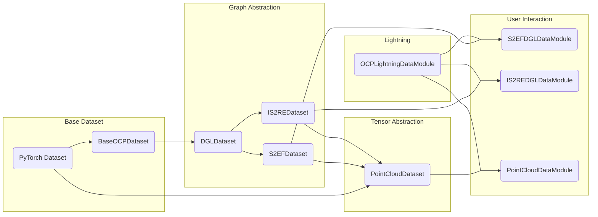

# Refactoring OCP Datasets

Inheritance/abstraction diagram:



## Dataset abstraction

At the top, we have the base PyTorch `Dataset` class which requires one to implement a `__getitem__` method that retrieves a single data point from a dataset. The intended way to build on top of this is to subclass `Dataset` into something that can concretely retrieve data; in this case, `BaseOCPDataset` handles all of the LMDB file nuances with I/O, and is able to read both the trajectory and single point LMDB files. In addition, `BaseOCPDataset` also sets the trend for two other patterns that aren't common in other PyTorch implementations: we also require `collate_fn` and `data_loader` abstract method and property; both are used by the `LightningDataModule` part of the pipeline to know how to batch data together and what loader to use (for example, PyG or DGL, later). If you wish to extend the library with your own dataset, you will need to subclass `Dataset` (most likely `BaseOCPDataset`), and make sure there are concrete functions for `collate_fn` and `data_loader`. If you are subclassing `BaseOCPDataset`, you most likely will just need to change the `data_from_key` function, which determines how the data is retrieved from disk before passing it to transforms. Typically, you shouldn't need to peer into the LMDB data at all.

An additional recommendation for how the data should be retrieved; while there is no strict enforcement, the style of datasets that have been implemented return a dictionary with string keys and tensor or graph data values. In particular, the `graph` key is used to refer to graph structures; consistency will  help keep the library maintainable.

The final layer of the data abstraction is PyTorch Lightning, `LightningDataModule`s. The idea behind this is to capture the logic behind data splits, distributed data parallelism, connecting dataset with dataloader, and so on. Ultimately, the baseline user will only need to interact with one of these modules, and never need to configure the `Dataset` level.

### `PointCloudDataModule`

This data representation is unique in the context of Open Catalyst, which was built on taking advantage of graph neural networks. Recent advances, notably by [Spellings (2021)](https://arxiv.org/abs/2110.02393), show promise in using geometric algebra to represent the eq/invariances typically afforded by graphs, without the need for graph neural networks. Since this is a relatively new type of format, the dataset interface may feel less mature compared to the other implementations.

For now, the `PointCloudDataset` _wraps_ around one of the OCP datasets, mainly to take advantage of how to process the differences in the LMDB data. Ostensibly, using these classes should not require that much more complexity in configuration, and can be readily created at the `LightningDataModule` level via class methods, `PointCloudDataModule.from_s2ef` and `PointCloudDataModule.from_is2re`. That said, it might be worth exploring re-implementing the point cloud representation as a transform (effectively a Python decorator) instead of its own dataset and data module.

The modules `trajectory_lmdb` and `single_point_lmdb` will be superceded by these changes. There will also be some refactoring needed from `ocpmodels.lightning.data_utils`, where we move the `LightningDataModule` blocks to within this module.

## Transforms interface

In other deep learning domains, transforms typically serve as ways to perform data augmentation: for example, image rotation and translation for computer vision, etc. Here, the concept works similarly but the interface serves also to augment the data _pipeline_ itself, that is to say intended to be used to generate new data and representations, not just graph rotations, etc. with the idea that you should not need to create new datasets to obtain extract new variables and representations. This improves on modularity: the typical route is to either implement these ideas at the model level (e.g. in the `forward` pass, we compute distances, etc.) or create a whole new dataset that includes these variables. Because the data are retrieved as dictionaries, you are free to manipulate, add, and remove keys after the data is loaded to modify it. The way that the collating function is designed should not require modification; graphs are batched together with `dgl.batch`, and tensors are stacked together, and should work for any variable number of batch items.

Two examples exist right now, which are the distance edge features (which add edge features based on distance and "reduced mass") and the graph level variables. In the former, we modify the graph `edata` by appending `r` and `mu`, while the latter adds a new tensor to the data dictionary being returned (`graph_variables`), and they both demonstrate how one can incorporate new data/features into the pipeline without modifying the codebase.

To incorporate these transforms in your pipeline, you can pass a list of instantiated objects (as you would for CV models) to the `LightningDataModules` in `ocpmodels/lightning/data_utils` module as a keyword argument:

```python
from ocpmodels.datasets import transforms as t

data_module = S2EFDGLDataModule(h5_path, transforms=[t.DistancesTransform(), t.GraphVariablesTransform()])
```

Transforms are performed sequentially, in the order that they are passed to the argument. In this case, `GraphVariablesTransform` depends on interatomic distances as the `r` key in `graph.edata`, so the `DistancesTransform` is applied first.