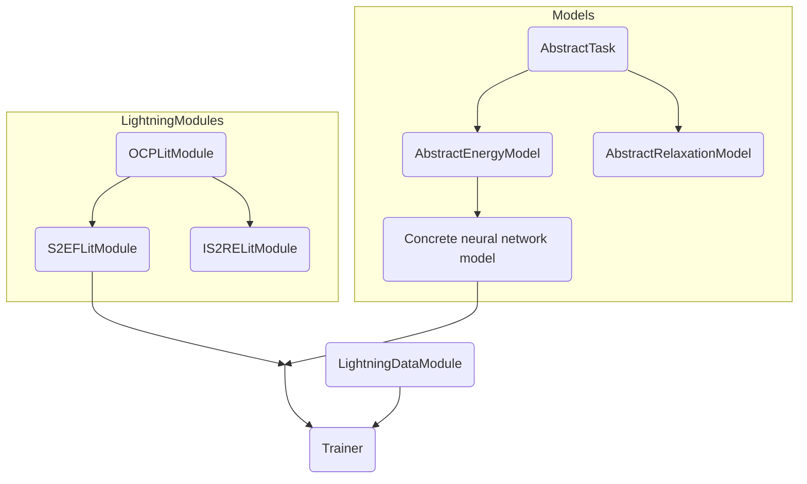
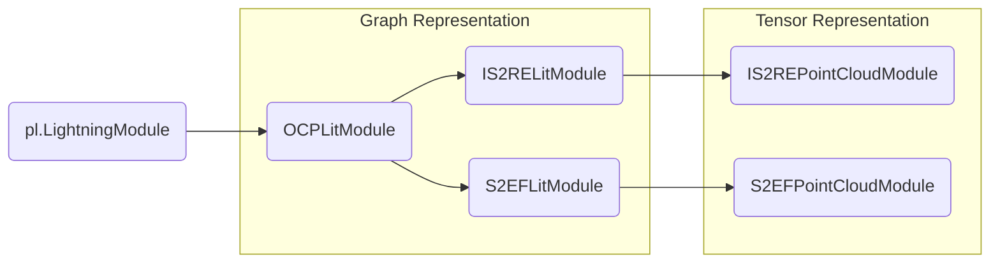

# Open MatSci ML Toolkit Model Development Guide

## Model development

Take advantage of the `AbstractTask` classes for development. This dictates and self-documents the expected
behavior of a given model; the `DimeNetPP` class (and others in the `ocpmodels.models.dgl` module) inherit
from the `AbstractEnergyModel` class. For now, the main reason for this inheritance is for the `LightningCLI`
type checking done by `jsonargparse`: the `S2EFLightningModule` expects an `AbstractTask` model, and functionally
otherwise there aren't any differences (for now).

The diagram below illustrates how the models and `pl.LightningModule` fits together: the latter defines
the logic for training, validation, and testing for a given task, including loss computation. The former
is up to the user to define: with our earlier example, the `AbstractEnergyModel` is intended to predict the energy
of a graph, and the associated `S2EFLightningModule` takes care of unpacking the batch, using the abstract
model to compute, compute the loss, and then log the data to any PyTorch Lightning logger. The workflow
is controlled by `pl.Trainer`, and the `LightningDataModule` handles the data.



Ultimately, the take home message is to focus on what you'd like to do: if you just want to develop a
new architecture, you can substitute `AbstractTask` for any model you'd like, as long as the output
is what is expected and you never have to really think about the training loop! In the PyTorch
Lightning abstraction, the `LightningModule` comprises a _system_ and the logic to combine them all,
and the models you define make up said system. In the case of OCP/Open MatSci ML Toolkit, there isn't much composition
required but it is still good to take advantage of cleaner looking code.

## Module layout recommendations

Organize models into framework submodules; for example, the DimeNet++ DGL implementation currently resides in `ocpmodels.models.dgl.dpp` as a submodule.

Within the submodule are modules that provide auxillary functionality in support of the model you want to develop: again with DimeNet++, we have
a `basis_func` module that uses SymPy for the basis function evaluation, and DimeNet++ block definitions in `dimenet_utils`. There is a
fair amount of organization, but this is all in the spirit of clean code :)

To make it easier to import your model later on, we recommend exposing the main class (e.g. `DimeNetPP`) of your model
into the `ocpmodels.models.dgl` namespace by adding it to `ocpmodels/models/dgl/__init__.py` (see the file contents)
for examples. You will then be able to load your model as  `from ocpmodels.models import Model`, as we just batch import
everything (poor practice, but we know the namespace is small) from each submodule. 


## Model development style guide
DGL's `DGLGraph` encapsulates the graph structure and the node/edge features in a single object. This object provides feature access through a dictionary-style API and a computational engine over the graph structure through the `DGlGraph.update_all` mechanics of message propagation/aggregation. These abstractions significantly reduce the complexity of implementing a GNN layer. However, if not appropriately managed, these abstractions can lead to unnecessary coupling between the data and layer logic. In what follows, we provide a general guide to implement GNN layers that is based on DGL's recommended style guide.

- Encapsulate all layer computations in a local scope using the local-scope context manager as recommended by DGL's [documentation](https://docs.dgl.ai/en/0.6.x/generated/dgl.DGLGraph.local_scope.html#dgl.DGLGraph.local_scope): "By entering a local scope, any out-place mutation to the feature data will not reflect to the original graph, thus making it easier to use in a function scope (e.g. forward computation of a model)." A code sample might look like as follows:
```python
class MyGraphNN(nn.Module):

	def forward(self, graph, features, edge_features):
		with graph.local_scope():
			feats = features
			edge_feats = edge_fea
			# compute a new node feature with an out-place operation
			graph.ndata['new_result'] = func(feats, ...)

			# do a global message iteration
			graph.update_all(...)

			# do some extra work
			...

>>> model = MyBetterGraphNN(...)
>>> graph = dgl.graph(...)
>>> ... = model(graph)
>>> `new_result` in graph.ndata 
False
```
- Explicitly pass features and attributes as arguments to the forward pass of the `nn.Module` implementation. This decouples the layer implementation from the data by localizing feature names to within layer methods. Consider the following two implementations:
```python
class MyGraphNN(nn.Module):

	def forward(self, graph):
		with graph.local_scope():
			# coupled to data pipeline through 'arbitrary' and `again_arbitrary`
			feats = graph.ndata['arbitrary']  
			edge_feats = graph.edata['again_arbitrary']
			# do something useful
			...

class MyBetterGraphNN(nn.Module):

	def forward(self, graph, features, edge_features):
		with graph.local_scope():
			graph.ndata['name_in_layer'] = features
			graph.edata['another_name_in_layer'] = edge_fea
			# do something useful
			...
```
`MyGraphNN` needs the incoming `graph` to have its features named `arbitrary` and `again_arbitrary` coupling the data pipeline to the layer. On the other hand, `MyBetterGraphNN` simply receives the required tensors without any assumption on the name scheme. This comes at zero cost as the data is all passed by reference. In particular, a training loop might look like
```python
def train_pass(graph: DGLGraph, model:nn.Module, ...):
	...
	# data loader produces DGLGraphs
	features = graph.ndata['arbitrary']
	out = model(graph, features)I
	...
	# learn something useful
```
- Implement individual messages as methods and use expressive names for intermediate and final features. Since `DGLGraph` utilizes dictionaries to hold features, the keys used to refer to these features are strings which makes them very expressive. This is powerful when implementing a specific architecture based on a reference as most names can follow exactly the names and conventions used in the reference. For example,
```python
class MyBetterGraphNN(nn.Module):
	""" Amazing GNN layers based on reference [X]. """

	def pos_update(self, graph):
		# magic
		...
		graph.edata['(xi-xj)*phi(mij)'] = graph.edata['xi-xj'] *  ...
		# where (xi-xj)*phi(mij) is eq.(Y) in ref [X]
		...

	def forward(self, graph, features, edge_features):
		with graph.local_scope():
			graph.ndata['name in ref[X]'] = features
			...
			out = self.pos_update(graph)
			...
```

## Pipeline development guide

Continuing the abstractions from the data parts of Open MatSci ML Toolkit, there are also stylistic considerations for the task (model) abstraction, particularly taking advantage of inheritance to minimize repetitive parts of the code.

PyTorch Lightning uses the `LightningModule` to define neural network _systems_, which can comprise multiple models. The `LightningModule` essentially defines how data passes through these individual models, as you normally would with the `forward` method, but includes additional aspects that help make the system self-contained. 

For Open MatSci ML Toolkit, `ocpmodels.models.base.OCPLitModule` takes care of most aspects of this, but adds a bit more flavor to handle different data abstractions and tasks. Starting from `__init__`, you can appreciate that the only component needed is a `gnn` argument, with the type hint `AbstractTask`: at a high level, our "system" comprises some neural network model that we pass data through, with reusable components across training, validation, and testing phases  of the deep learning development process. The `forward`, `training_step`, `validation_step`, and `test_step` methods define exactly this, which are canonical PyTorch Lightning methods. One other method is `configure_optimizers`, which is also required by `LightningModule` in order to define the minimal pipeline.

In our case, we offload a lot of the logic to reusable `step`, `_compute_losses`, `_get_inputs`, and `_get_batch_size` functions. The `step` function, at a high level, offers the baseline for what needs to be done in _any_ part of the train/validate/test process, which is just `_compute_losses` given a batch of data, and log the metrics we compute. For the base class, `validation_step` and `test_step` simply call `step`. You will notice that `_compute_losses` and `training_step` however are decorated with `@abstractmethod`: they are intended to be implemented for classes that inherit from `OCPLitModule`, as we have task-specific nuances in training. The remaining two functions, `_get_inputs` and `_get_batch_size`, are intended to be changed depending on the data representation: if the data collating/representation changes, you can redefine these functions without having to change the rest of the pipeline. You can see examples of this in point cloud variants of the task `LightningModule`s.

To summarize with a codeblock, the minimum we need to create new tasks that inherit from `OCPLitModule`:

```python
class CoolNewTask(OCPLitModule):
	def training_step(self, batch: Dict[str, Union[torch.Tensor, dgl.DGLGraph]], batch_idx: int) -> float:
		"""Perform a training step; take a batch of data, compute and backprop losses"""
		...

	def _compute_losses(self, batch: Dict[str, Union[torch.Tensor, dgl.DGLGraph]]) -> Dict[str, float]:
		"""Take a dictionary of batched data, calculate and return a dictionary of loss values"""
		...
```

For the simplest concrete implementation of an OCP task, look at `IS2RELitModule`. In this class, we implement `_compute_losses` to represent the logic for IS2RE: given an intial structure, predict the relaxed energy. The `_compute_losses` is responsible for containing how the data is unpacked from an abstract batch, running the model with the data, then calculating the collection of losses.

The `S2EFLitModule` requires some additional complexity, as we are doing something that isn't typically (currently) done in neural network training, which is a double-gradient pass: for `regress_forces`, we will compute the first derivative of energy with respect to atom positions, which you can see is implemented in the `forward` method. We then overwrite the `training_step` to perform [_manual optimization_](https://pytorch-lightning.readthedocs.io/en/1.6.3/common/optimization.html?highlight=manual%20optimization#manual-optimization), and for our purposes, call `self.manual_backward` twice for the force and backprop steps. While one could subclass `IS2RELitModule` for `S2EFLitModule`, we chose to decouple the two tasks so that potential modifications to IS2RE will not affect S2EF.

The remaining piece to describe is `_get_inputs` and `_get_batch_size`. As previously mentioned, you can see examples of when you would use it, for example in the `IS2REPointCloudModule`:

```python
class IS2REPointCloudModule(IS2RELitModule):
    def forward(
        self, features: torch.Tensor, positions: torch.Tensor, *args, **kwargs
    ) -> torch.Tensor:
        """
        Implements the forward method for a point cloud representation.

        Instead of passing a DGL graph, the model should expect `features`
        and `positions` args; additional args and kwargs are passed into
        the abstract model's `forward` method.

        Parameters
        ----------
        features : torch.Tensor
            N-D Tensor containing features, with shape [B, *] for B batch
            entries.
        positions : torch.Tensor
            Tensor containing atom positions

        Returns
        -------
        torch.Tensor
            Float Tensor containing the energy of each batch entry
        """
        return self.model(features, positions, *args, **kwargs)

    def _get_inputs(
        self, batch: Dict[str, Union[torch.Tensor, dgl.DGLGraph]]
    ) -> Tuple[Union[torch.Tensor, dgl.DGLGraph]]:
        """Get the input data from keys `pc_features` and `pos`"""
        features, positions = batch.get("pc_features"), batch.get("pos")
        return (features, positions)

    def _get_batch_size(
        self, batch: Dict[str, Union[torch.Tensor, dgl.DGLGraph]]
    ) -> int:
        """Determine the batch size from the first dimension of `pc_features`"""
        return int(batch.get("pc_features").size(0))
```

 Despite having a _very_ different data representation to the other graph-based models in the pipeline, you can see that the only things that you need to modify are `forward`, and the two methods currently being discussed. The former helps by explicitly stating what the minimum arguments an abstract point cloud model might take, and the latter changes the behavior of `_compute_losses`, `step`, etc. without needing to reimplement them because your data structure has changed. `_get_inputs` simply takes the data you want from your dictionary of batched data (e.g. `batch.get("pc_features")`) instead of graphs, and returns a tuple that gets unpacked into (i.e. `IS2REPointCloudModule.forward(*_get_inputs(batch))`). The `_get_batch_size` isn't crucial for the pipeline to function, but makes sure that the current batch size can be deduced for when the metrics are reduced at the end of steps and epochs.

### Inheritance diagram


